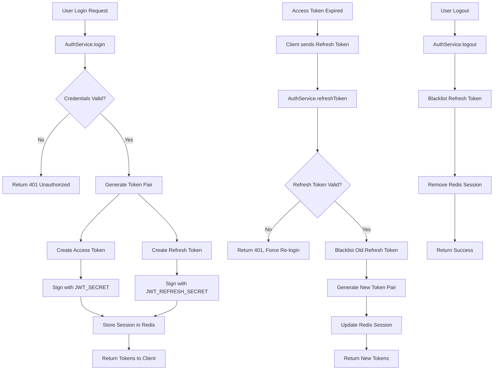

# Auth JWT Token Flow

## Overview
Complete authentication flow using JWT access and refresh tokens, including PKCE support, token rotation, and session management with Redis caching.

## Trigger Points
- User submits login credentials
- Access token expires and refresh is needed
- User logs out
- Protected route access without valid token

## Flow Diagram


## Key Components
- **File**: `server/src/services/AuthService.ts` - JWT generation, validation, token rotation
- **File**: `server/src/middleware/auth.ts` - authenticateToken middleware
- **File**: `server/src/routes/auth.ts` - /api/auth/login, /refresh, /logout endpoints
- **File**: `src/contexts/AuthContext.tsx` - Frontend auth state, token refresh logic
- **Database**: `users` - User credentials and profile
- **Database**: `sessions` - Active session tracking
- **Cache**: Redis - Session cache, token blacklist

## Data Flow
1. Input: Login credentials
   ```typescript
   {
     email: string,
     password: string
   }
   ```
2. Transformations:
   - Validate credentials against PostgreSQL users table
   - Generate access token (15min expiry)
   - Generate refresh token (7d expiry)
   - Store session metadata in Redis
3. Output: Token pair
   ```typescript
   {
     accessToken: string,   // JWT, 15min expiry
     refreshToken: string,  // JWT, 7d expiry
     user: {
       id: string,
       email: string,
       role: 'user' | 'editor' | 'admin'
     }
   }
   ```

## Error Scenarios
- Invalid credentials (wrong email/password)
- Refresh token already blacklisted (reuse attempt)
- Redis connection failure (fallback to DB-only)
- JWT_SECRET not configured
- Token signature verification failed

## Dependencies
- **PostgreSQL** `:5432` - User storage, session persistence
- **Redis** `:6379` - Session cache, token blacklist
- **jsonwebtoken** - JWT signing and verification
- **bcrypt** - Password hashing
