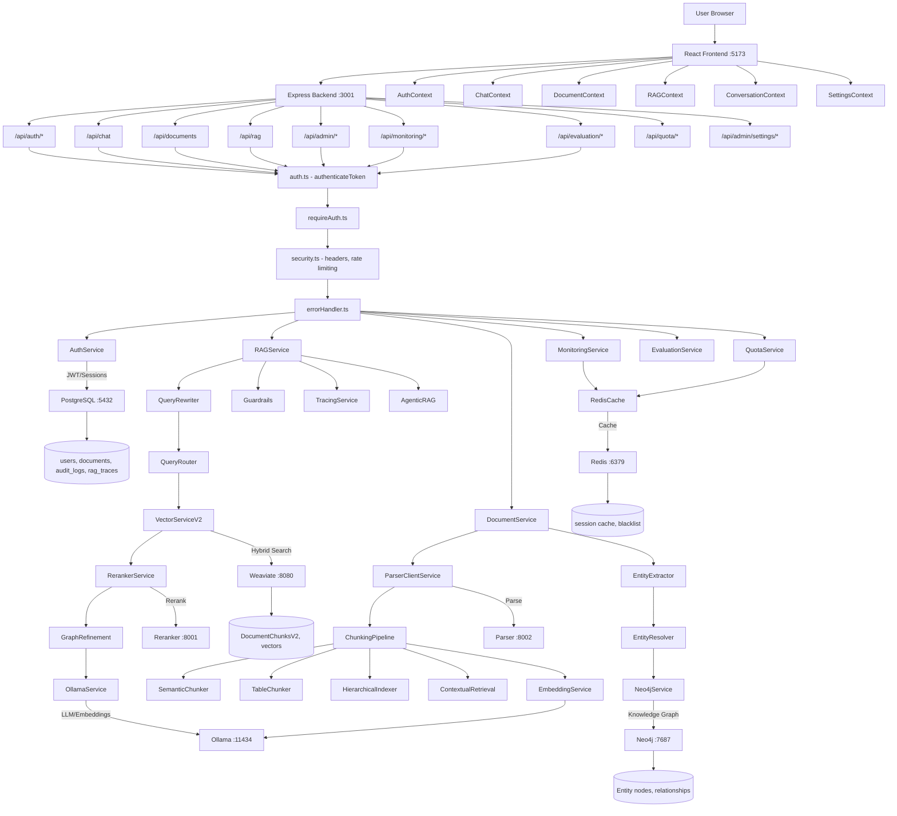

# Vexora Architecture Overview

## Overview
Complete system architecture for Vexora, a RAG-powered chat application with document management, knowledge graph integration, multi-model LLM support, evaluation framework, and production monitoring.

## Trigger Points
- System startup and initialization
- New feature implementation planning
- Debugging cross-component issues
- Onboarding new developers or AI assistants

## Flow Diagram


## Key Components

### Frontend (React + Vite + TypeScript)
- **File**: `src/contexts/AuthContext.tsx` - JWT management, token refresh, user state
- **File**: `src/contexts/ChatContext.tsx` - Message state, streaming, RAG integration
- **File**: `src/contexts/ConversationContext.tsx` - Chat history, conversation management
- **File**: `src/contexts/RAGContext.tsx` - RAG mode (manual/automatic/always), document selection, intent detection
- **File**: `src/contexts/DocumentContext.tsx` - Document list, upload state
- **File**: `src/contexts/SettingsContext.tsx` - User preferences, model settings
- **File**: `src/contexts/ThemeContext.tsx` - Dark/light mode
- **File**: `src/contexts/ToastContext.tsx` - Notification system

### Frontend Pages
- **File**: `src/pages/LoginPage.tsx` - Authentication UI (Microsoft/Google SSO)
- **File**: `src/pages/DocumentsPage.tsx` - Document management with upload, categories, tags, permissions
- **File**: `src/pages/DocumentsPageEmbedded.tsx` - Embedded document view variant
- **File**: `src/pages/AdminUsersPage.tsx` - User administration (RBAC)
- **File**: `src/pages/AuditLogsPage.tsx` - Security audit logs
- **File**: `src/pages/AdminSystemSettingsPage.tsx` - System configuration
- **File**: `src/pages/ProfilePage.tsx` - User profile

### Frontend Libraries
- **File**: `src/lib/httpClient.ts` - HTTP client with automatic 401 detection and token refresh retry
- **File**: `src/lib/intentDetection.ts` - Client-side query intent analysis for automatic RAG activation
- **File**: `src/lib/api.ts` - API abstraction layer
- **File**: `src/lib/errorHandler.ts` - Frontend error handling
- **File**: `src/lib/conversationStorage.ts` - Local conversation persistence
- **File**: `src/lib/storageQuota.ts` - Client-side storage quota tracking
- **File**: `src/lib/settingsStorage.ts` - Persisted user settings including hybridSearchAlpha (default 0.3)

### Frontend Components
- **File**: `src/components/ModelSettings.tsx` - Model settings UI with hybridSearchAlpha slider (0-1 range, default 0.3)

### Backend Core Services
- **File**: `server/src/services/AuthService.ts` - JWT, PKCE, token rotation, OAuth2 sessions, audit logging
- **File**: `server/src/services/RAGService.ts` - Query routing, search, LLM generation (streaming + non-streaming)
- **File**: `server/src/services/DocumentService.ts` - Multi-format upload, V1/V2 processing, metadata, permissions (RLS)
- **File**: `server/src/services/VectorServiceV2.ts` - Weaviate V2 hybrid search with hierarchical chunks + document expansion via `getChunksByDocumentIds()`
- **File**: `server/src/services/VectorService.ts` - Legacy V1 Weaviate search (flat chunks)
- **File**: `server/src/services/OllamaService.ts` - LLM and embedding client (qwen3:8b/14b, nomic-embed-text)
- **File**: `server/src/services/EmbeddingService.ts` - Vector generation (768d nomic-embed-text)
- **File**: `server/src/services/DatabaseService.ts` - PostgreSQL connection pool with RLS support
- **File**: `server/src/services/QuotaService.ts` - Storage quota management per user
- **File**: `server/src/services/LoggerService.ts` - Structured logging without sensitive data
- **File**: `server/src/services/DocumentEventService.ts` - Event emitter for document lifecycle events
- **File**: `server/src/services/ProcessingJobService.ts` - Background document processing job management

### RAG Pipeline
- **File**: `server/src/services/rag/QueryRewriter.ts` - Resolves pronouns/references in follow-up questions using chat history (LLM-based, think:false, truncated history)
- **File**: `server/src/services/rag/QueryRouter.ts` - Query classification (factual, comparative, procedural, relational, aggregative, temporal), strategy selection, level filter (with manual override support)
- **File**: `server/src/services/rag/RerankerService.ts` - BGE-reranker-v2-m3 cross-encoder reranking via Python service
- **File**: `server/src/services/rag/ContextualRetrieval.ts` - LLM-generated chunk context (Anthropic technique)
- **File**: `server/src/services/rag/AgenticRAG.ts` - Tool-calling RAG with iterative search (Qwen3 tool calling)
- **File**: `server/src/services/guardrails/Guardrails.ts` - Input validation (injection detection) and output validation (citation check, groundedness)

### Chunking Pipeline
- **File**: `server/src/services/parsing/ParserClientService.ts` - HTTP client for Docling parser microservice (:8002)
- **File**: `server/src/services/chunking/SemanticChunker.ts` - Embedding-based breakpoints via cosine similarity
- **File**: `server/src/services/chunking/TableChunker.ts` - Table extraction and structure-preserving chunking
- **File**: `server/src/services/chunking/HierarchicalIndexer.ts` - Level 0/1/2 hierarchy with optional abstractive summaries
- **File**: `server/src/services/chunking/ChunkingPipeline.ts` - Orchestrates SemanticChunker + TableChunker + HierarchicalIndexer + ContextualRetrieval

### Graph Services
- **File**: `server/src/services/graph/GraphService.ts` - Main graph interface for entity extraction and storage
- **File**: `server/src/services/graph/Neo4jService.ts` - Cypher query execution
- **File**: `server/src/services/graph/EntityExtractor.ts` - Named entity recognition (persons, organizations, projects)
- **File**: `server/src/services/graph/EntityResolver.ts` - Entity deduplication via embedding similarity
- **File**: `server/src/services/graph/GraphRefinement.ts` - RAG result enrichment via Neo4j traversal

### Observability and Monitoring
- **File**: `server/src/services/observability/TracingService.ts` - End-to-end trace spans (query_analysis, vector_search, reranking, graph_traversal, llm_generation, guardrails)
- **File**: `server/src/services/monitoring/MonitoringService.ts` - Dashboard metrics, alerts, system health
- **File**: `server/src/services/cache/RedisCache.ts` - Redis cache client with TTL support

### Evaluation Framework
- **File**: `server/src/services/evaluation/EvaluationService.ts` - RAG evaluation runs
- **File**: `server/src/services/evaluation/GoldenDatasetService.ts` - Golden dataset management for evaluation
- **File**: `server/src/services/evaluation/EmbeddingBenchmark.ts` - Embedding model benchmarking

### Middleware
- **File**: `server/src/middleware/auth.ts` - JWT verification (authenticateToken), optional auth, role-based access (requireRole)
- **File**: `server/src/middleware/requireAuth.ts` - Simplified auth guard
- **File**: `server/src/middleware/security.ts` - HTTPS enforcement, CSP, HSTS, rate limiting, input sanitization, secure cookies
- **File**: `server/src/middleware/errorHandler.ts` - Global error handling with structured responses

### API Routes
- **File**: `server/src/routes/auth.ts` - `/api/auth/microsoft/*, /api/auth/google/*, /refresh, /logout, /me, /status`
- **File**: `server/src/routes/admin.ts` - `/api/admin/users, /stats, /audit-logs`
- **File**: `server/src/routes/settings.ts` - `/api/admin/settings/*`
- **File**: `server/src/routes/quota.ts` - `/api/quota/me, /validate, /statistics`
- **File**: `server/src/routes/monitoring.ts` - `/api/monitoring/dashboard, /health, /alerts, /cache, /traces`
- **File**: `server/src/routes/evaluation.ts` - `/api/evaluation/*` (Admin only - golden dataset, eval runs, benchmarks)
- **File**: `server/src/index.ts` - Main server with `/api/chat`, `/api/documents`, `/api/health` endpoints

## Data Flow
1. Input: User request (chat message or document upload)
   ```typescript
   // Chat Request
   {
     messages: ChatMessage[],
     model: string,           // e.g., "qwen3:8b"
     stream: boolean,
     rag: {
       enabled: boolean,
       query: string,
       searchLimit: number,     // default: 5
       searchThreshold: number, // default: 0.1
       hybridAlpha: number,     // default: 0.3 (70% BM25, 30% vector)
     }
   }
   ```
2. Transformations:
   - JWT validation via authenticateToken middleware
   - Query rewriting for follow-up questions (resolves pronouns/references via LLM)
   - Query routing via QueryRouter (type classification + strategy selection)
   - Hybrid search via Weaviate (BM25 + vector, alpha=0.3)
   - Reranking via BGE-reranker-v2-m3 (cross-encoder relevance)
   - Document expansion (load all chunks from top documents)
   - Graph enrichment via Neo4j entity expansion (optional)
   - LLM generation via Ollama streaming
   - Output guardrails (citation check, groundedness)
3. Output: SSE stream with RAG sources
   ```typescript
   {
     content: string,          // Streamed chunks
     sources: RAGSource[],     // Cited document chunks
     conversationId: string,
     graphEnriched?: boolean,
   }
   ```

## Error Scenarios
- JWT token expired or invalid (auto-refresh via httpClient)
- Database connection pool exhausted
- Weaviate hybrid search timeout
- Reranker service unavailable (graceful fallback to original ordering)
- Ollama model not loaded or timeout
- Neo4j connection failed (continues without graph enrichment)
- Parser microservice unavailable (fallback for text formats)
- Document parsing errors (corrupted/encrypted files)
- Storage quota exceeded
- Rate limit exceeded (10/15min for auth, 100/15min for admin, 200/15min general)
- Input guardrails reject query (injection detection)

## Dependencies

### Ubuntu Server (192.168.178.23)
- **PostgreSQL** `:5432` - pgvector/pgvector:pg17 (users, documents, audit_logs, rag_traces, chunk_metadata, golden_queries)
- **Weaviate** `:8080` - v1.28.4 (hybrid search, DocumentChunksV2 + V1 legacy)
- **Neo4j** `:7687` - 5.26-community (knowledge graph, entity nodes + relationships)
- **Redis** `:6379` - 7-alpine (session cache, token blacklist, monitoring cache)
- **Reranker** `:8001` - BGE-reranker-v2-m3 (systemd service, cross-encoder reranking)
- **Parser** `:8002` - Docling-based Python service (multi-format document parsing)

### Local Mac
- **Ollama** `:11434` - LLM (qwen3:8b/14b) + Embeddings (nomic-embed-text, 768d)
- **Vite** `:5173` - Frontend dev server
- **Express** `:3001` - Backend API server

---

Last Updated: 2026-02-11
