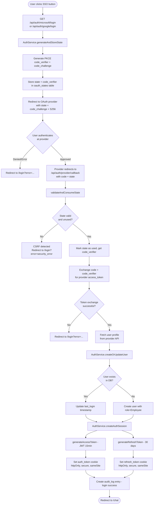
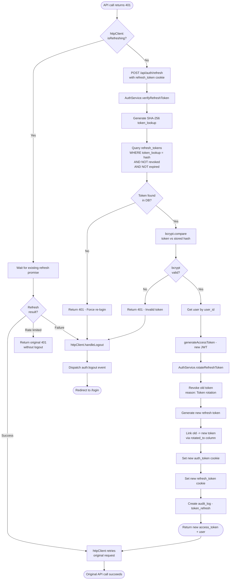
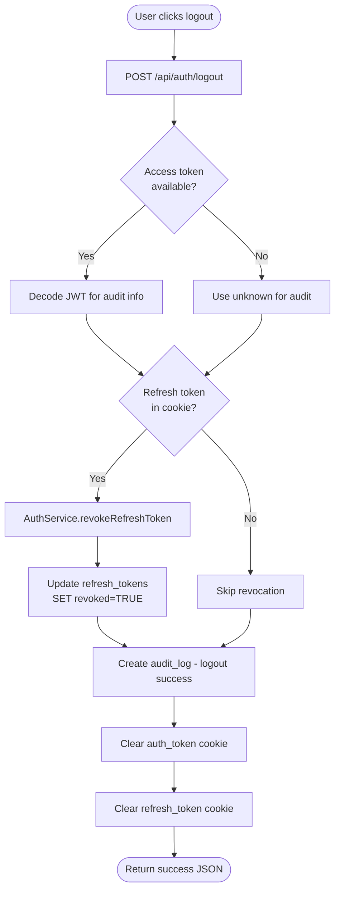
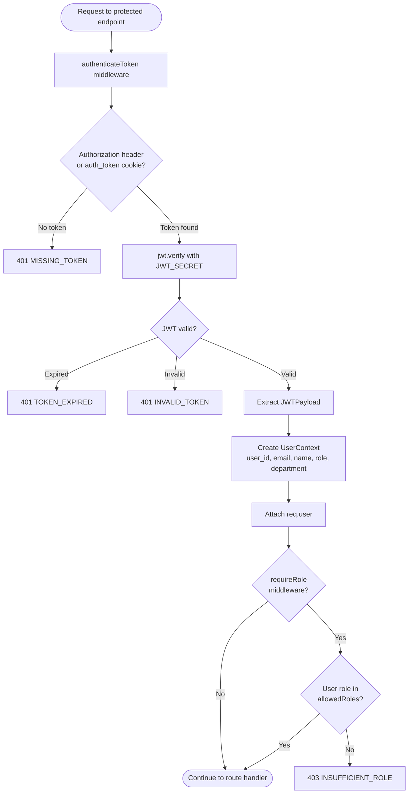

# Auth JWT Token Flow

## Overview
Complete enterprise authentication flow using Microsoft and Google OAuth2 with PKCE (OAuth 2.1), JWT access tokens, refresh token rotation, RBAC authorization, and audit logging. Tokens are delivered via httpOnly secure cookies.

## Trigger Points
- User clicks "Sign in with Microsoft" or "Sign in with Google" on the login page
- Access token expires (15min) and frontend httpClient automatically triggers refresh
- User logs out (manual or forced after refresh failure)
- Protected route access without valid token (401 response triggers refresh flow)
- Frontend httpClient receives 401 and invokes automatic token management

## Flow Diagram

### OAuth2 Login Flow (Microsoft / Google)


### Token Refresh Flow (Automatic via httpClient)


### Logout Flow


### Protected Route Access (Middleware)


## Key Components

### Backend - Authentication Service
- **File**: `server/src/services/AuthService.ts` - Core auth service: OAuth2 flow, JWT generation, token rotation, PKCE, user management, audit logging
- **Function**: `createMicrosoftAuthUrl()` in `AuthService.ts` - Generates Microsoft OAuth2 URL with CSRF state + PKCE code_challenge
- **Function**: `createGoogleAuthUrl()` in `AuthService.ts` - Generates Google OAuth2 URL with CSRF state + PKCE code_challenge
- **Function**: `exchangeMicrosoftCode()` in `AuthService.ts` - Exchanges authorization code for Microsoft user info with PKCE verification
- **Function**: `exchangeGoogleCode()` in `AuthService.ts` - Exchanges authorization code for Google user info with PKCE verification
- **Function**: `createOrUpdateUser()` in `AuthService.ts` - Upserts user from OAuth provider info, defaults role to Employee
- **Function**: `generateAccessToken()` in `AuthService.ts` - Signs JWT with user_id, email, name, role, department (15min expiry)
- **Function**: `generateRefreshToken()` in `AuthService.ts` - Creates bcrypt-hashed + SHA-256 lookup refresh token (30 day expiry)
- **Function**: `verifyRefreshToken()` in `AuthService.ts` - Two-stage lookup: SHA-256 fast query + bcrypt verification
- **Function**: `rotateRefreshToken()` in `AuthService.ts` - Revokes old token, generates new, links via rotated_to audit trail
- **Function**: `createAuthSession()` in `AuthService.ts` - Combines access + refresh token generation into a session

### Backend - Middleware
- **File**: `server/src/middleware/auth.ts` - JWT verification middleware: authenticateToken, optionalAuth, requireRole
- **Function**: `authenticateToken()` in `auth.ts` - Validates JWT from Bearer header or auth_token cookie, attaches UserContext to req
- **Function**: `optionalAuth()` in `auth.ts` - Non-blocking auth: continues anonymously if token missing or invalid
- **Function**: `requireRole()` in `auth.ts` - RBAC middleware: checks req.user.role against allowed roles list
- **File**: `server/src/middleware/requireAuth.ts` - Simplified auth guard checking req.user exists
- **File**: `server/src/middleware/security.ts` - Security middleware: HTTPS enforcement, CSP, HSTS, rate limiting, input sanitization, secure cookies

### Backend - Routes
- **File**: `server/src/routes/auth.ts` - Auth API endpoints: OAuth login/callback, /me, /refresh, /logout, /status
- **Route**: `GET /api/auth/microsoft/login` - Initiates Microsoft OAuth2 flow with PKCE
- **Route**: `GET /api/auth/microsoft/callback` - Handles Microsoft OAuth2 callback, creates session, sets cookies
- **Route**: `GET /api/auth/google/login` - Initiates Google OAuth2 flow with PKCE
- **Route**: `GET /api/auth/google/callback` - Handles Google OAuth2 callback, creates session, sets cookies
- **Route**: `GET /api/auth/me` - Returns current user info from JWT (requires DB lookup for fresh data)
- **Route**: `POST /api/auth/refresh` - Refreshes access token with refresh token rotation
- **Route**: `POST /api/auth/logout` - Revokes refresh token, clears cookies, logs audit event
- **Route**: `GET /api/auth/status` - Lightweight auth check (JWT-only, no DB)

### Backend - Types & Config
- **File**: `server/src/types/auth.ts` - TypeScript types: User, JWTPayload, RefreshToken, AuthSession, UserContext, UserRole, etc.
- **File**: `server/src/config/env.ts` - Environment config: JWT_SECRET, JWT_EXPIRES_IN, FRONTEND_URL, BACKEND_URL

### Frontend
- **File**: `src/lib/httpClient.ts` - HTTP client with automatic 401 detection, token refresh retry, and logout on failure
- **Function**: `handleUnauthorized()` in `httpClient.ts` - Deduplicates concurrent refresh attempts with shared promise
- **Function**: `attemptTokenRefresh()` in `httpClient.ts` - Calls /api/auth/refresh, dispatches auth:token-refreshed event
- **File**: `src/types/auth.ts` - Frontend auth types: AuthState, LoginResponse, RefreshResponse, ROLE_PERMISSIONS matrix

### Database Tables
- **Database**: `users` - User accounts with email, name, role (Employee/Manager/Admin), department, provider, is_active
- **Database**: `refresh_tokens` - Hashed refresh tokens with token_lookup (SHA-256), revoked flag, rotated_to link, expiry
- **Database**: `oauth_states` - Temporary CSRF state storage with code_verifier (PKCE), 10min expiry, single-use enforcement
- **Database**: `audit_logs` - Security audit trail: user actions, results, IP, user-agent, JSONB metadata
- **Database**: `documents` (extended) - owner_id, department, classification, allowed_roles, allowed_users with RLS policies

### Migrations
- **File**: `server/src/migrations/001_enterprise_auth_setup.sql` - Creates users, refresh_tokens, audit_logs tables; extends documents; enables RLS
- **File**: `server/src/migrations/002_token_rotation_optimization.sql` - Adds token_lookup (SHA-256), revoked, rotated_to columns
- **File**: `server/src/migrations/003_oauth_state.sql` - Creates oauth_states table for CSRF protection
- **File**: `server/src/migrations/004_pkce_support.sql` - Adds code_verifier column for PKCE (OAuth 2.1)

## Data Flow

1. **Input**: User initiates OAuth login
   ```typescript
   // Browser navigates to:
   GET /api/auth/microsoft/login
   // or
   GET /api/auth/google/login
   ```

2. **OAuth State Generation**:
   - Generate 64-char random state (CSRF token)
   - Generate PKCE code_verifier (43 chars, base64url)
   - Generate code_challenge = BASE64URL(SHA256(code_verifier))
   - Store state + code_verifier in `oauth_states` table (10min expiry)
   - Redirect to provider with state + code_challenge + S256 method

3. **OAuth Callback Processing**:
   - Provider redirects with `code` + `state` query params
   - Validate state against `oauth_states` table (single-use)
   - Retrieve stored `code_verifier` for PKCE
   - Exchange `code` + `code_verifier` for provider access_token
   - Fetch user profile from provider API (Microsoft Graph / Google userinfo)

4. **User Upsert**:
   ```typescript
   // Microsoft user info
   { id, displayName, mail, userPrincipalName, department, ... }
   // Google user info
   { id, email, verified_email, name, given_name, picture, ... }
   // Mapped to User record:
   { id: UUID, email, name, role: 'Employee', department?, provider, provider_id }
   ```

5. **Session Creation**:
   ```typescript
   // JWT Access Token payload (15min expiry):
   {
     user_id: string,
     email: string,
     name: string,
     role: 'Employee' | 'Manager' | 'Admin',
     department?: string,
     iat: number,
     exp: number
   }
   // Refresh Token (30 day expiry):
   // - Plain token returned to client via httpOnly cookie
   // - bcrypt hash stored in refresh_tokens table
   // - SHA-256 lookup key stored for fast verification
   ```

6. **Output**: httpOnly secure cookies set on response
   ```typescript
   // Cookie: auth_token (JWT access token)
   { httpOnly: true, secure: isProduction, sameSite: 'strict'|'lax', maxAge: 900000 }
   // Cookie: refresh_token (plain refresh token)
   { httpOnly: true, secure: isProduction, sameSite: 'strict'|'lax', maxAge: 2592000000 }
   // Redirect to: /chat
   ```

7. **Token Refresh Output**:
   ```typescript
   {
     access_token: string,  // New JWT, 15min expiry
     user: {
       id: string,
       email: string,
       name: string,
       role: 'Employee' | 'Manager' | 'Admin',
       department?: string
     }
   }
   // Plus updated httpOnly cookies for both tokens
   ```

## Error Scenarios
- **CSRF attack detected**: State parameter missing, expired, already used, or mismatched provider (validateAndConsumeState returns false)
- **OAuth provider error**: User denies consent, provider returns error_description (redirect to /login?error=...)
- **Token exchange failure**: Invalid authorization code, expired code, or PKCE mismatch (Microsoft/Google returns non-200)
- **No email in profile**: Microsoft user without mail/userPrincipalName or Google user without email (throws Error)
- **JWT_SECRET not configured**: Falls back to dev-secret with warning log (security risk in production)
- **Access token expired**: authenticateToken returns 401 TOKEN_EXPIRED; httpClient auto-retries with refresh
- **Refresh token revoked or expired**: verifyRefreshToken returns null; user forced to re-login
- **Refresh token reuse detected**: rotateRefreshToken logs warning for potential token theft (token already revoked)
- **Rate limiting on refresh**: httpClient returns 'rate_limited' status; user is NOT logged out, original 401 returned
- **Database connection failure**: Query failures in user lookup or token storage cause 500 errors
- **Last admin protection**: updateUser prevents removing the last active Admin role

## Dependencies
- **PostgreSQL** `:5432` - User storage (users), refresh token persistence (refresh_tokens), OAuth state (oauth_states), audit logs (audit_logs), RLS-enabled document access
- **jsonwebtoken** - JWT signing (HS256) and verification for access tokens
- **bcrypt** - Password-grade hashing for refresh token storage
- **crypto** (Node.js built-in) - SHA-256 for token_lookup optimization, randomBytes for state/token generation, base64url for PKCE
- **Microsoft Identity Platform** - OAuth2 authorization + token endpoint (login.microsoftonline.com), Microsoft Graph API for user profile
- **Google OAuth2** - OAuth2 authorization (accounts.google.com) + token endpoint (oauth2.googleapis.com), userinfo API
- **Express.js** - HTTP routing, cookie management, middleware pipeline
- **cookie-parser** - Parsing httpOnly cookies for token extraction

---

Last Updated: 2026-02-06
