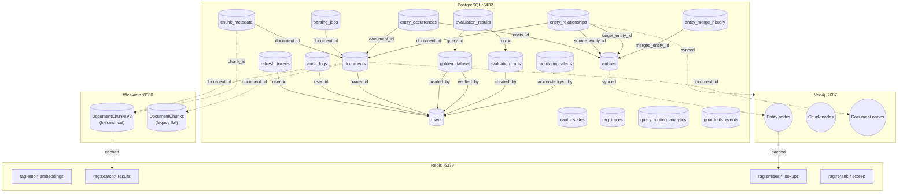

# Database Schema Relations

## Overview
Complete data storage schema for the Cor7ex project across all four storage engines: PostgreSQL (relational data, RLS), Weaviate (vector search, hybrid BM25+semantic), Neo4j (knowledge graph), and Redis (caching). Includes table relationships, column details, and cross-store data flow.

## Trigger Points
- Database schema changes or new migrations
- Adding new tables, collections, or indexes
- Debugging cross-store data consistency issues
- Onboarding new developers or AI assistants

## Flow Diagram

### Cross-Store Entity Relationships

### PostgreSQL Table Relations (ER Diagram)

```mermaid
erDiagram
    users ||--o{ refresh_tokens : "has"
    users ||--o{ audit_logs : "creates"
    users ||--o{ documents : "owns"
    users ||--o{ golden_dataset : "creates/verifies"
    users ||--o{ evaluation_runs : "creates"
    users ||--o{ monitoring_alerts : "acknowledges"

    documents ||--o{ chunk_metadata : "has"
    documents ||--o{ parsing_jobs : "has"
    documents ||--o{ entity_occurrences : "referenced_in"
    documents ||--o{ entity_relationships : "sourced_from"

    entities ||--o{ entity_occurrences : "appears_in"
    entities ||--o{ entity_relationships : "source/target"
    entities ||--o{ entity_merge_history : "merged_into"

    evaluation_runs ||--o{ evaluation_results : "contains"
    golden_dataset ||--o{ evaluation_results : "evaluated_by"

    users {
        UUID id PK
        VARCHAR email UK
        VARCHAR name
        VARCHAR role "Employee/Manager/Admin"
        VARCHAR department
        VARCHAR provider "microsoft/google"
        VARCHAR provider_id
        BOOLEAN is_active
        TIMESTAMP created_at
        TIMESTAMP last_login
    }

    documents {
        VARCHAR id PK
        VARCHAR filename
        VARCHAR file_type "pdf/docx/pptx/xlsx/html/md/txt"
        BIGINT file_size
        TIMESTAMP upload_date
        TIMESTAMP processed_date
        VARCHAR status
        INTEGER chunk_count
        VARCHAR category
        TEXT_ARRAY tags
        UUID owner_id FK
        VARCHAR department
        VARCHAR classification "public/internal/confidential/restricted"
        TEXT_ARRAY allowed_roles
        UUID_ARRAY allowed_users
        VARCHAR file_format
        VARCHAR parser_used
        INTEGER parsing_duration_ms
        VARCHAR chunking_version "v1/v2"
        INTEGER total_tokens
        INTEGER page_count
        JSONB outline
    }

    refresh_tokens {
        UUID id PK
        UUID user_id FK
        VARCHAR token_hash UK
        VARCHAR token_lookup UK "SHA-256"
        BOOLEAN revoked
        TIMESTAMP revoked_at
        VARCHAR revoked_reason
        UUID rotated_to FK "self-ref"
        TIMESTAMP expires_at
        TIMESTAMP created_at
    }

    audit_logs {
        UUID id PK
        UUID user_id FK
        VARCHAR user_email
        VARCHAR action
        VARCHAR resource_type
        VARCHAR resource_id
        VARCHAR result "success/failure/denied"
        INET ip_address
        TEXT user_agent
        JSONB metadata
        TIMESTAMP created_at
    }

    oauth_states {
        UUID id PK
        VARCHAR state UK
        VARCHAR provider "microsoft/google"
        VARCHAR code_verifier "PKCE"
        TIMESTAMP created_at
        TIMESTAMP expires_at
        TIMESTAMP used_at
        INET ip_address
    }

    chunk_metadata {
        UUID id PK
        VARCHAR document_id FK
        VARCHAR chunk_id UK
        INTEGER chunk_index
        INTEGER level "0=doc 1=section 2=para"
        VARCHAR parent_chunk_id
        VARCHAR path
        VARCHAR chunking_method
        INTEGER page_start
        INTEGER page_end
        INTEGER token_count
        INTEGER char_count
        TIMESTAMP created_at
    }

    parsing_jobs {
        UUID id PK
        VARCHAR document_id FK
        VARCHAR status
        VARCHAR parser
        VARCHAR file_format
        BIGINT file_size_bytes
        TIMESTAMP started_at
        TIMESTAMP completed_at
        INTEGER duration_ms
        INTEGER blocks_extracted
        INTEGER tables_extracted
        INTEGER chunks_created
        TEXT error_message
        JSONB warnings
    }

    entities {
        UUID id PK
        VARCHAR type "PERSON/ORG/PROJECT/etc"
        TEXT text
        TEXT canonical_form
        TEXT_ARRAY aliases
        DECIMAL confidence
        JSONB metadata
        BOOLEAN neo4j_synced
        TIMESTAMP created_at
        TIMESTAMP updated_at
    }

    entity_occurrences {
        SERIAL id PK
        UUID entity_id FK
        VARCHAR document_id FK
        TEXT chunk_id
        INTEGER position
        TEXT context
        TIMESTAMP created_at
    }

    entity_relationships {
        UUID id PK
        UUID source_entity_id FK
        UUID target_entity_id FK
        VARCHAR type "WORKS_FOR/MANAGES/etc"
        DECIMAL confidence
        TEXT evidence
        VARCHAR document_id FK
        VARCHAR extraction_method "pattern/spacy/llm"
        BOOLEAN neo4j_synced
        TIMESTAMP created_at
    }

    entity_merge_history {
        SERIAL id PK
        UUID merged_entity_id FK
        UUID_ARRAY source_entity_ids
        VARCHAR merge_method
        DECIMAL similarity_score
        TIMESTAMP merged_at
    }

    golden_dataset {
        UUID id PK
        TEXT query
        TEXT expected_answer
        UUID_ARRAY relevant_document_ids
        TEXT_ARRAY relevant_chunk_ids
        VARCHAR category "factual/comparative/etc"
        VARCHAR difficulty "easy/medium/hard"
        TEXT_ARRAY key_facts
        TEXT_ARRAY forbidden_content
        UUID created_by FK
        UUID verified_by FK
        TIMESTAMP last_evaluated_at
        DECIMAL last_precision_at_5
        DECIMAL last_recall_at_20
        DECIMAL last_groundedness
    }

    evaluation_runs {
        UUID id PK
        VARCHAR version
        JSONB config
        DECIMAL avg_precision_at_5
        DECIMAL avg_recall_at_20
        DECIMAL avg_groundedness
        INTEGER avg_latency_ms
        JSONB metrics_by_category
        VARCHAR status "pending/running/completed/failed"
        TIMESTAMP started_at
        TIMESTAMP completed_at
        UUID created_by FK
    }

    evaluation_results {
        UUID id PK
        UUID run_id FK
        UUID query_id FK
        DECIMAL precision_at_1
        DECIMAL precision_at_3
        DECIMAL precision_at_5
        DECIMAL precision_at_10
        DECIMAL precision_at_20
        DECIMAL recall_at_5
        DECIMAL recall_at_20
        DECIMAL mrr
        DECIMAL groundedness
        DECIMAL answer_relevance
        BOOLEAN hallucination_detected
        INTEGER latency_total_ms
        TEXT_ARRAY retrieved_chunk_ids
    }

    rag_traces {
        SERIAL id PK
        UUID trace_id UK
        TIMESTAMP timestamp
        VARCHAR user_id_hash
        VARCHAR session_id
        INTEGER query_length
        VARCHAR query_type
        VARCHAR retrieval_strategy
        BOOLEAN success
        INTEGER total_latency_ms
        INTEGER tokens_used
        INTEGER chunks_retrieved
        INTEGER chunks_used
        JSONB spans
    }

    monitoring_alerts {
        SERIAL id PK
        VARCHAR alert_type
        VARCHAR severity "info/warning/error/critical"
        TEXT message
        JSONB metadata
        BOOLEAN acknowledged
        UUID acknowledged_by FK
        TIMESTAMP acknowledged_at
        TIMESTAMP created_at
    }

    query_routing_analytics {
        SERIAL id PK
        TIMESTAMP timestamp
        VARCHAR query_hash
        VARCHAR query_type
        VARCHAR retrieval_strategy
        INTEGER entities_found
        BOOLEAN is_multi_hop
        BOOLEAN required_graph
        BOOLEAN required_table
        DECIMAL routing_confidence
        BOOLEAN actual_success
        INTEGER latency_ms
    }

    guardrails_events {
        SERIAL id PK
        TIMESTAMP timestamp
        VARCHAR event_type
        VARCHAR user_id_hash
        JSONB details
        VARCHAR query_hash
    }
```

## Key Components

### PostgreSQL
- **File**: `server/src/services/DatabaseService.ts` - Connection pool (max 20 clients), query helpers, transaction support
- **Database**: `cor7ex` on `:5432` - pgvector/pgvector:pg17 with RLS enabled on `documents` table

### Weaviate
- **File**: `server/src/services/VectorServiceV2.ts` - V2 collection with hierarchical schema (DocumentChunksV2)
- **File**: `server/src/services/VectorService.ts` - V1 legacy collection (DocumentChunks)
- **Database**: Weaviate `:8080` (HTTP) / `:50051` (gRPC) - v1.28.4

### Neo4j
- **File**: `server/src/services/graph/Neo4jService.ts` - Driver wrapper with Cypher query execution
- **Database**: Neo4j `:7687` - 5.26-community with APOC plugin

### Redis
- **File**: `server/src/services/cache/RedisCache.ts` - ioredis client with LRU eviction and TTL-based caching
- **Database**: Redis `:6379` - 7-alpine with 512MB max memory

### Migrations
- **File**: `server/src/migrations/001_enterprise_auth_setup.sql` - users, refresh_tokens, audit_logs; extends documents with RLS
- **File**: `server/src/migrations/002_token_rotation_optimization.sql` - token_lookup (SHA-256), revoked, rotated_to columns
- **File**: `server/src/migrations/003_oauth_state.sql` - oauth_states table for CSRF protection
- **File**: `server/src/migrations/004_pkce_support.sql` - code_verifier column for PKCE (OAuth 2.1)
- **File**: `server/src/migrations/005_golden_dataset.sql` - golden_dataset, evaluation_runs, evaluation_results tables
- **File**: `server/src/migrations/006_document_processing_v2.sql` - chunk_metadata, parsing_jobs tables; extends documents with V2 columns
- **File**: `server/src/migrations/007_graph_entities.sql` - entities, entity_occurrences, entity_relationships, entity_merge_history tables
- **File**: `server/src/migrations/008_observability.sql` - rag_traces, monitoring_alerts, query_routing_analytics, guardrails_events tables

## Data Flow

### PostgreSQL Tables (18 tables)

#### Authentication Domain (5 tables)
| Table | Primary Key | Foreign Keys | RLS | Purpose |
|-------|------------|--------------|-----|---------|
| `users` | UUID id | - | No | User accounts with SSO providers |
| `refresh_tokens` | UUID id | user_id -> users, rotated_to -> self | No | JWT refresh tokens with rotation chain |
| `audit_logs` | UUID id | user_id -> users | No | Security audit trail |
| `oauth_states` | UUID id | - | No | CSRF state + PKCE code_verifier (10min expiry) |
| `documents` | VARCHAR id | owner_id -> users | **Yes** | Document metadata with 6 RLS policies |

#### Document Processing Domain (2 tables)
| Table | Primary Key | Foreign Keys | Purpose |
|-------|------------|--------------|---------|
| `chunk_metadata` | UUID id | document_id -> documents | V2 chunk hierarchy metadata |
| `parsing_jobs` | UUID id | document_id -> documents | Parsing job tracking |

#### Knowledge Graph Domain (4 tables)
| Table | Primary Key | Foreign Keys | Purpose |
|-------|------------|--------------|---------|
| `entities` | UUID id | - | Extracted entities synced with Neo4j |
| `entity_occurrences` | SERIAL id | entity_id -> entities, document_id -> documents | Entity-document-chunk links |
| `entity_relationships` | UUID id | source/target -> entities, document_id -> documents | Entity relationships synced with Neo4j |
| `entity_merge_history` | SERIAL id | merged_entity_id -> entities | Audit trail for entity resolution |

#### Evaluation Domain (3 tables)
| Table | Primary Key | Foreign Keys | Purpose |
|-------|------------|--------------|---------|
| `golden_dataset` | UUID id | created_by/verified_by -> users | Curated query-answer pairs |
| `evaluation_runs` | UUID id | created_by -> users | Evaluation run configuration and aggregates |
| `evaluation_results` | UUID id | run_id -> evaluation_runs, query_id -> golden_dataset | Per-query evaluation metrics |

#### Observability Domain (4 tables)
| Table | Primary Key | Foreign Keys | Purpose |
|-------|------------|--------------|---------|
| `rag_traces` | SERIAL id | - | End-to-end RAG query traces with spans |
| `monitoring_alerts` | SERIAL id | acknowledged_by -> users | System alerts for monitoring |
| `query_routing_analytics` | SERIAL id | - | Query routing decision analytics |
| `guardrails_events` | SERIAL id | - | Input/output guardrails event log |

### PostgreSQL Views (5 views)
| View | Purpose |
|------|---------|
| `document_processing_stats` | Document processing statistics with chunk breakdowns |
| `graph_statistics` | Knowledge graph entity and relationship counts |
| `trace_stats_hourly` | Hourly aggregated RAG trace metrics (7-day window) |
| `query_type_stats` | Query type distribution and success rates (24h) |
| `strategy_performance` | Retrieval strategy performance metrics (24h) |
| `guardrails_summary` | Hourly guardrails event summary (24h) |

### PostgreSQL Functions
| Function | Purpose |
|----------|---------|
| `set_user_context(UUID, VARCHAR, VARCHAR)` | Sets RLS context for permission-aware queries |
| `cleanup_expired_tokens()` | Removes expired and old revoked refresh tokens |
| `cleanup_expired_oauth_states()` | Removes expired and old used OAuth states |
| `detect_token_reuse()` | Trigger function to detect refresh token reuse attacks |
| `get_child_chunks(VARCHAR)` | Returns child chunks of a parent chunk |
| `get_document_chunk_hierarchy(VARCHAR)` | Returns full chunk hierarchy for a document |
| `get_document_entity_stats(VARCHAR)` | Returns entity statistics per document |
| `update_golden_dataset_timestamp()` | Trigger function for auto-updating updated_at |
| `update_entities_updated_at()` | Trigger function for auto-updating entities.updated_at |

### RLS Policies on `documents` Table
| Policy | Access | Condition |
|--------|--------|-----------|
| `documents_public_policy` | SELECT | classification = 'public' |
| `documents_department_policy` | SELECT | Same department + internal/public |
| `documents_owner_policy` | ALL | owner_id matches app.user_id |
| `documents_role_policy` | SELECT | User role in allowed_roles |
| `documents_user_policy` | SELECT | User ID in allowed_users |
| `documents_admin_policy` | ALL | User role is Admin |

### Weaviate Collections (2 collections)

#### DocumentChunksV2 (Hierarchical - Primary)
| Property | Type | Filterable | Searchable (BM25) | Description |
|----------|------|------------|-------------------|-------------|
| documentId | TEXT | Yes | Yes | Parent document reference |
| content | TEXT | No | Yes | Chunk text content |
| chunkIndex | INT | Yes | No | Position within document |
| totalChunks | INT | No | No | Total chunks in document |
| level | INT | Yes | No | 0=doc, 1=section, 2=paragraph |
| parentChunkId | TEXT | Yes | No | Parent in hierarchy |
| path | TEXT | Yes | Yes | Hierarchy path |
| chunkingMethod | TEXT | Yes | No | semantic/table/fixed/hybrid |
| pageStart | INT | Yes | No | Start page |
| pageEnd | INT | Yes | No | End page |
| tokenCount | INT | No | No | Estimated tokens |
| filename | TEXT | Yes | Yes | Document filename |
| originalName | TEXT | Yes | Yes | Original upload name |
| pageCount | INT | No | No | Total document pages |
| _vector | float32[768] | - | - | nomic-embed-text embedding |

#### DocumentChunks (Legacy V1 - Flat)
| Property | Type | Filterable | Searchable (BM25) | Description |
|----------|------|------------|-------------------|-------------|
| documentId | TEXT | Yes | Yes | Parent document reference |
| content | TEXT | No | Yes | Chunk text content |
| pageNumber | INT | Yes | No | Page number |
| chunkIndex | INT | Yes | No | Position within document |
| totalChunks | INT | No | No | Total chunks in document |
| filename | TEXT | Yes | Yes | Document filename |
| originalName | TEXT | Yes | Yes | Original upload name |
| pages | INT | No | No | Total document pages |
| _vector | float32[768] | - | - | nomic-embed-text embedding |

### Neo4j Node and Relationship Types

#### Node Labels
| Label | Properties | Description |
|-------|-----------|-------------|
| Entity | id, type, text, canonicalForm, aliases, confidence, updatedAt | Base entity (also has type-specific label) |
| PERSON | (inherits Entity) | Person entities |
| ORGANIZATION | (inherits Entity) | Organization entities |
| PROJECT | (inherits Entity) | Project entities |
| PRODUCT | (inherits Entity) | Product entities |
| LOCATION | (inherits Entity) | Location entities |
| DATE | (inherits Entity) | Date entities |
| REGULATION | (inherits Entity) | Regulation entities |
| TOPIC | (inherits Entity) | Topic entities |
| Document | id | Document reference node |
| Chunk | id | Chunk reference node |

#### Relationship Types
| Type | Source -> Target | Properties | Description |
|------|-----------------|-----------|-------------|
| MENTIONED_IN | Entity -> Chunk | position | Entity appears in chunk |
| PART_OF | Chunk -> Document | - | Chunk belongs to document |
| WORKS_FOR | PERSON -> ORGANIZATION | id, confidence, evidence, documentId, extractionMethod | Employment |
| MANAGES | PERSON -> PROJECT | id, confidence, evidence, documentId, extractionMethod | Management |
| CREATED | ORGANIZATION -> PROJECT/PRODUCT | id, confidence, evidence, documentId, extractionMethod | Creation |
| COLLABORATES_WITH | PERSON -> PERSON | id, confidence, evidence, documentId, extractionMethod | Collaboration |
| REFERENCES | DOCUMENT -> REGULATION | id, confidence, evidence, documentId, extractionMethod | Reference |
| ABOUT | DOCUMENT -> TOPIC | id, confidence, evidence, documentId, extractionMethod | Topic association |
| REPORTS_TO | PERSON -> PERSON | id, confidence, evidence, documentId, extractionMethod | Reporting |
| APPROVED_BY | any -> PERSON | id, confidence, evidence, documentId, extractionMethod | Approval |
| MENTIONS | any -> any | id, confidence, evidence, documentId, extractionMethod | Generic mention |

#### Neo4j Indexes
| Index | Target | Property |
|-------|--------|----------|
| entity_id | Entity | id |
| entity_canonical | Entity | canonicalForm |
| entity_type | Entity | type |
| document_id | Document | id |
| chunk_id | Chunk | id |

### Redis Cache Structure

| Key Pattern | TTL | Purpose |
|-------------|-----|---------|
| `rag:emb:{model}:{sha256}` | 3600s (1h) | Cached embedding vectors |
| `rag:search:{sha256}` | 300s (5min) | Cached hybrid search results |
| `rag:entities:{sha256}` | 3600s (1h) | Cached entity lookups |
| `rag:rerank:{sha256}` | 600s (10min) | Cached reranker scores |

Configuration: keyPrefix=`rag:`, maxMemory=512MB, eviction=allkeys-lru

## Error Scenarios
- PostgreSQL connection pool exhausted (max 20 clients) - queries queue or timeout
- RLS context not set before document query (returns no results instead of error)
- Weaviate hybrid search timeout (60s query timeout) or gRPC connection failure
- Neo4j APOC plugin not installed (traversal queries fail)
- Redis connection failure (graceful degradation - cache misses, no errors)
- Migration execution order violation (foreign key constraints fail)
- Weaviate V2 collection schema drift (property mismatch on existing collection)
- Neo4j entity sync out of date (neo4j_synced=false flag in PostgreSQL)

## Dependencies
- **PostgreSQL** `:5432` - pgvector/pgvector:pg17 with RLS, 18 tables, 5 views, 9 functions
- **Weaviate** `:8080/:50051` - v1.28.4, 2 collections (DocumentChunksV2 + DocumentChunks legacy)
- **Neo4j** `:7687` - 5.26-community with APOC, 11 node labels, 11 relationship types, 5 indexes
- **Redis** `:6379` - 7-alpine, 4 cache categories, 512MB max, LRU eviction

---

Last Updated: 2026-02-06
