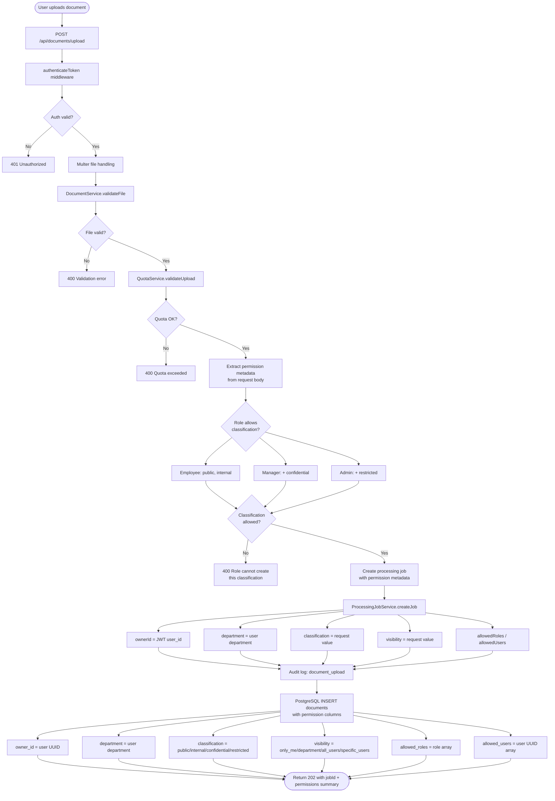
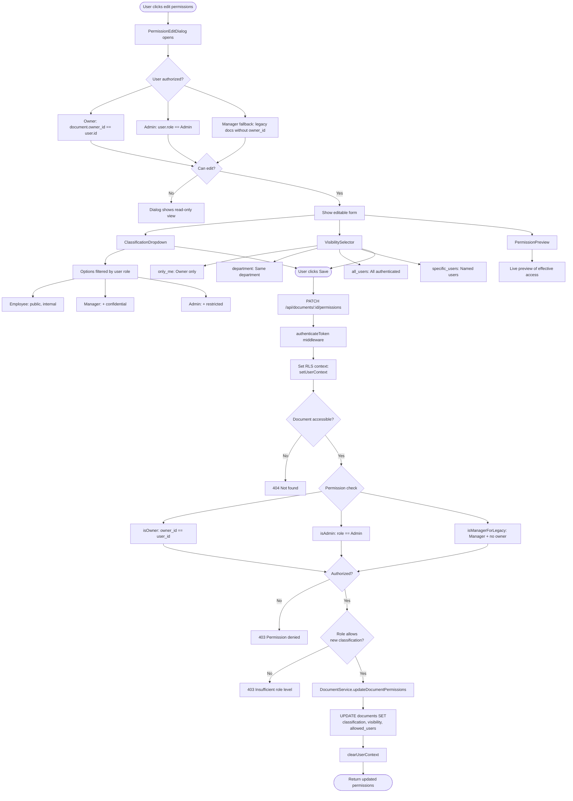
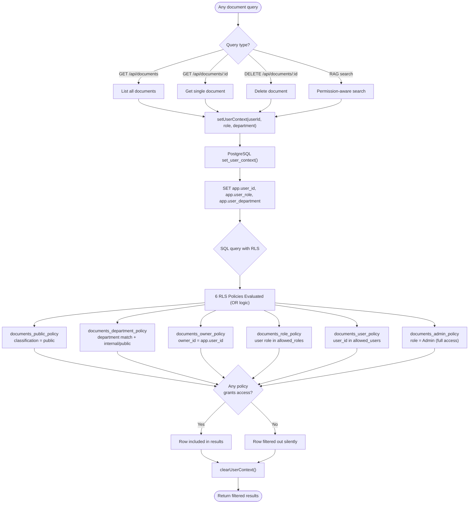
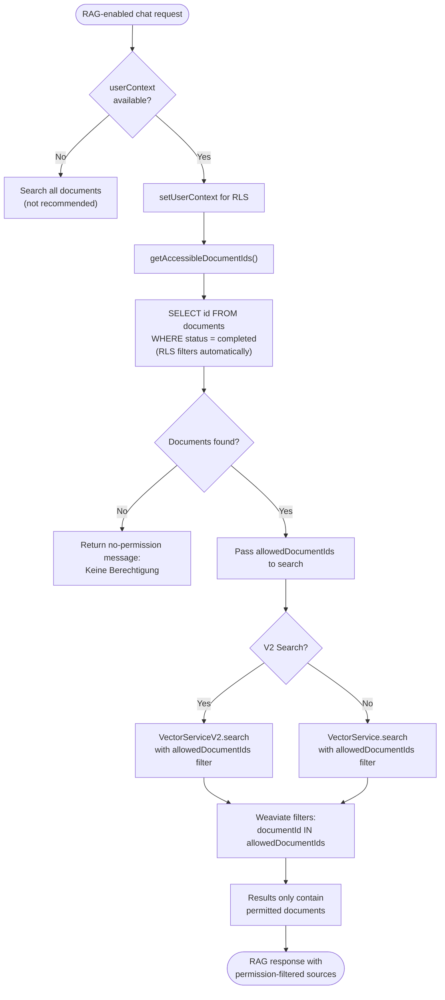

# Document Permissions Flow

## Overview
Complete document permission lifecycle for Cor7ex, covering classification-based access control, visibility settings, PostgreSQL Row-Level Security (RLS) enforcement, permission-aware document queries, permission editing by owners/admins, and integration with RAG search filtering.

## Trigger Points
- User uploads a document with classification and visibility settings
- User edits document permissions via PermissionEditDialog
- Any document query (list, detail, delete, search) triggers RLS evaluation
- RAG search filters results by user-accessible documents
- Admin manages documents across all departments

## Flow Diagram

### Document Upload with Permissions


### Permission Editing Flow


### RLS-Based Document Access (Query Time)


### RAG Permission Integration


## Key Components

### Frontend - Permission UI
- **File**: `src/components/PermissionEditDialog.tsx` - Modal for editing document classification, visibility, and specific user access; checks owner/admin authorization before allowing edits
- **File**: `src/components/ClassificationDropdown.tsx` - Dropdown with 4 classification levels (public, internal, confidential, restricted); filters options by user role
- **File**: `src/components/VisibilitySelector.tsx` - Radio selector with 4 visibility types (only_me, department, all_users, specific_users)
- **File**: `src/components/PermissionPreview.tsx` - Live preview of effective permissions based on selected classification and visibility
- **File**: `src/components/DocumentUploadWithPermissions.tsx` - Upload component with integrated permission settings (classification + visibility)

### Frontend - Context and State
- **File**: `src/contexts/AuthContext.tsx` - Provides user role, department, and ID for permission checks
- **File**: `src/contexts/DocumentContext.tsx` - Document list state with permission metadata per document

### Backend - Document Service
- **File**: `server/src/services/DocumentService.ts` - Core document service with RLS integration
- **Function**: `setUserContext()` in `DocumentService.ts` - Calls PostgreSQL `set_user_context(userId, role, department)` to configure RLS session variables
- **Function**: `getAccessibleDocumentIds()` in `DocumentService.ts` - Returns document IDs filtered by RLS policies (used by RAG search)
- **Function**: `getAccessibleDocuments()` in `DocumentService.ts` - Returns full document metadata filtered by RLS (used by document list/detail)
- **Function**: `updateDocumentPermissions()` in `DocumentService.ts` - Updates classification, visibility, and allowed_users columns
- **Function**: `clearUserContext()` in `DocumentService.ts` - Resets RLS session variables to NULL after query

### Backend - API Endpoints
- **File**: `server/src/index.ts` - Express server with document endpoints
- **Route**: `POST /api/documents/upload` - Upload with classification and visibility metadata, role-based classification validation
- **Route**: `GET /api/documents` - List documents filtered by RLS
- **Route**: `GET /api/documents/:id` - Get single document filtered by RLS
- **Route**: `DELETE /api/documents/:id` - Delete document with RLS access check + audit logging
- **Route**: `PATCH /api/documents/:id/permissions` - Edit permissions (owner/admin only), role-based classification validation
- **Route**: `POST /api/documents/bulk-delete` - Bulk delete with RLS filtering

### Backend - RAG Integration
- **File**: `server/src/services/RAGService.ts` - RAG service that filters search by user-accessible documents
- **Function**: `generateResponse()` in `RAGService.ts` - Sets RLS context, gets accessible document IDs, passes them to vector search
- **Function**: `generateStreamingResponse()` in `RAGService.ts` - Streaming variant with same permission filtering

### Backend - Quota Service
- **File**: `server/src/services/QuotaService.ts` - Per-user storage quota validation before upload

### Database - RLS Policies
- **File**: `server/src/migrations/001_enterprise_auth_setup.sql` - Creates 6 RLS policies and set_user_context function
- **Database**: `documents` table - RLS-enabled with owner_id, department, classification, allowed_roles, allowed_users columns

### Database - PostgreSQL Function
- **Function**: `set_user_context(UUID, VARCHAR, VARCHAR)` - Sets `app.user_id`, `app.user_role`, `app.user_department` session variables for RLS evaluation

## Data Flow

1. **Input (Upload)**: Permission metadata in upload request
   ```typescript
   // Form data:
   {
     file: File,
     classification: 'public' | 'internal' | 'confidential' | 'restricted',
     visibility: 'only_me' | 'department' | 'all_users' | 'specific_users',
     specificUsers: string[],   // User IDs (only for specific_users visibility)
     department?: string,       // Override (defaults to JWT user department)
   }
   // Derived from JWT:
   {
     ownerId: string,           // user_id from JWT
     userRole: 'Employee' | 'Manager' | 'Admin',
     userDepartment: string,
   }
   ```

2. **Storage**: Permission columns in PostgreSQL `documents` table
   ```typescript
   {
     owner_id: UUID,                // Document owner (from JWT)
     department: string,            // Owner's department
     classification: string,        // public | internal | confidential | restricted
     visibility: string,            // only_me | department | all_users | specific_users
     allowed_roles: string[],       // ['Employee', 'Manager', 'Admin'] or null
     allowed_users: UUID[],         // Specific user IDs or null
   }
   ```

3. **RLS Evaluation**: 6 policies evaluated with OR logic
   - Public: `classification = 'public'` (visible to all)
   - Department: `department = app.user_department AND classification IN ('internal', 'public')`
   - Owner: `owner_id = app.user_id` (full CRUD)
   - Role: `app.user_role = ANY(allowed_roles)`
   - User: `app.user_id = ANY(allowed_users)`
   - Admin: `app.user_role = 'Admin'` (full CRUD, all documents)

4. **Permission Edit Input**:
   ```typescript
   // PATCH /api/documents/:id/permissions
   {
     classification: 'public' | 'internal' | 'confidential' | 'restricted',
     visibility: 'only_me' | 'department' | 'all_users' | 'specific_users',
     specificUsers: string[],
   }
   ```

5. **Role-Classification Matrix**:
   ```
   Employee -> can set: public, internal
   Manager  -> can set: public, internal, confidential
   Admin    -> can set: public, internal, confidential, restricted
   ```

6. **Output**: Permission-filtered results
   ```typescript
   // Document list response:
   {
     documents: DocumentMetadata[],  // Only RLS-permitted documents
     totalCount: number,
   }
   // RAG search response:
   {
     sources: RAGSource[],           // Only from permitted documents
     hasRelevantSources: boolean,
   }
   ```

## Error Scenarios
- User attempts to upload with classification above their role level (400 with allowed classifications)
- User attempts to edit permissions on a document they don't own (403 Permission denied)
- Manager attempts to set restricted classification (403 Insufficient role level)
- RLS context not set before document query (returns no results silently - not an error)
- User has no accessible documents for RAG search (returns German-language no-permission message)
- PostgreSQL connection failure during set_user_context (500 error, query fails)
- Document owner deleted but document remains (Admin-only access until reassigned)
- Legacy documents without owner_id (Manager/Admin can edit as fallback)
- Bulk delete includes documents user cannot access (silently skips inaccessible documents)

## Dependencies
- **PostgreSQL** `:5432` - Row-Level Security (RLS) with 6 policies on `documents` table, `set_user_context()` function
- **Express.js** - HTTP routing with `authenticateToken` middleware providing JWT-based user context
- **Weaviate** `:8080` - Vector search filtered by `allowedDocumentIds` parameter (documents pre-filtered by RLS)
- **React** - Frontend permission components (ClassificationDropdown, VisibilitySelector, PermissionPreview, PermissionEditDialog)

---

Last Updated: 2026-02-06
