# Document Processing Flow

## Overview
Complete document ingestion pipeline for the Cor7ex project, covering multi-format file upload, validation, parsing via Docling microservice, semantic chunking with table awareness, hierarchical indexing, contextual retrieval enrichment, embedding generation, multi-store persistence (Weaviate + PostgreSQL), and knowledge graph entity extraction via Neo4j.

## Trigger Points
- User uploads a document via the Documents page (drag-and-drop or file picker)
- Frontend `DocumentContext` dispatches upload to backend API
- POST `/api/documents/upload` with multipart form-data (file + metadata)
- Supported formats: PDF, DOCX, PPTX, XLSX, HTML, MD, TXT (max 150MB)

## Flow Diagram

```mermaid
graph TD
    A([User uploads document]) --> B["POST /api/documents/upload"]
    B --> C[authenticateToken middleware]
    C --> D{Auth valid?}
    D -->|No| E["401 Unauthorized"]
    D -->|Yes| F[Multer file handling]

    F --> G[DocumentService.validateFile]
    G --> H{Format supported?}
    H -->|No| I["400 Unsupported format"]
    H -->|Yes| J{File size <= 150MB?}
    J -->|No| K["400 File too large"]
    J -->|Yes| L[DocumentService.processDocument]

    L --> M{CHUNKING_VERSION?}
    M -->|v2| N[processDocumentV2]
    M -->|v1| O[processPDFv1 - legacy]

    %% V2 Pipeline
    N --> P["Step 1: ParserClientService.parseBuffer"]
    P --> P1{Parser service available?}
    P1 -->|Yes| P2["POST to Docling :8002/parse"]
    P1 -->|No text format| P3[Fallback parser - paragraph split]
    P1 -->|No binary format| P4[V2 fails - fall back to V1]
    P4 --> O

    P2 --> P5{Parse successful?}
    P5 -->|No| P4
    P5 -->|Yes| Q["ParsedDocument with blocks"]

    P3 --> Q

    Q --> R["Step 2: ChunkingPipeline.processFromParsed"]
    R --> R1{Has table blocks?}
    R1 -->|Yes| R2[TableChunker.chunkTables]
    R1 -->|No| R3[Skip tables]
    R2 --> R4[Non-table blocks]
    R3 --> R4

    R4 --> R5{Chunking strategy?}
    R5 -->|semantic| R6[SemanticChunker.chunkBlocks]
    R5 -->|fixed| R7[Fixed-size word chunking]
    R5 -->|hybrid| R8["Semantic with fixed fallback"]

    R6 --> S[Merge text + table chunks]
    R7 --> S
    R8 --> S

    S --> T["Step 3: HierarchicalIndexer.createHierarchy"]
    T --> T1["Level 0: Document summary"]
    T --> T2["Level 1: Section summaries"]
    T --> T3["Level 2: Paragraph chunks"]

    T1 --> U{Abstractive summaries enabled?}
    T2 --> U
    U -->|Yes| U1["LLM generates summaries via Ollama"]
    U -->|No| U2["Extractive summaries - first N chars"]
    U1 --> V[Final hierarchical chunks]
    U2 --> V
    T3 --> V

    V --> W{Contextual Retrieval enabled?}
    W -->|Yes| W1["LLM generates context per chunk"]
    W1 --> W2["Prepend context to chunk content"]
    W -->|No| X[Continue]
    W2 --> X

    X --> Y["Step 4: VectorServiceV2.storeChunks"]
    Y --> Y1["Generate embeddings via Ollama"]
    Y1 --> Y2["Store in Weaviate DocumentChunksV2"]

    X --> Z["Step 5: VectorService.storeDocument - V1 compat"]
    Z --> Z1["Store in Weaviate V1 collection"]

    Y2 --> AA["Step 6: PostgreSQL INSERT documents"]
    Z1 --> AA
    AA --> AB["Step 7: PostgreSQL INSERT chunk_metadata"]
    AB --> AC["Step 8: GraphService.processDocument"]

    AC --> AC1{Neo4j available?}
    AC1 -->|Yes| AD[EntityExtractor.extract]
    AD --> AE[EntityResolver.resolve]
    AE --> AF["Neo4j: Store entities + relationships"]
    AC1 -->|No| AG["Skip graph extraction - non-critical"]

    AF --> AH[LoggerService.logDocument]
    AG --> AH
    AH --> AI(["Return ProcessingResult with metadata"])

    %% V1 Legacy Pipeline
    O --> OA["extractText via unpdf"]
    OA --> OB["VectorService.storeDocument"]
    OB --> OC["PostgreSQL INSERT documents"]
    OC --> OD["GraphService.processDocument"]
    OD --> AH
```


## Key Components

### Document Upload and Validation
- **File**: `server/src/index.ts` - Express server with multer upload handler at POST `/api/documents/upload`
- **Function**: `DocumentService.validateFile()` in `server/src/services/DocumentService.ts` - Validates file size (150MB max) and format support (PDF, DOCX, PPTX, XLSX, HTML, MD, TXT)
- **Function**: `DocumentService.processDocument()` in `server/src/services/DocumentService.ts` - Main orchestrator that routes to V2 or V1 processing

### Document Parsing (V2)
- **File**: `server/src/services/parsing/ParserClientService.ts` - HTTP client for Docling-based Python parser microservice on :8002
- **Function**: `ParserClientService.parseBuffer()` - Sends base64-encoded file to parser, returns `ParsedDocument` with content blocks
- **Function**: `ParserClientService.fallbackParse()` - Simple paragraph-split fallback for text formats (TXT, MD, HTML) when parser service is unavailable
- **Function**: `ParserClientService.checkHealth()` - Health check with 60s cache interval

### Semantic Chunking
- **File**: `server/src/services/chunking/SemanticChunker.ts` - Embedding-based semantic chunking using cosine similarity breakpoints
- **Function**: `SemanticChunker.chunkBlocks()` - Extracts sentences, generates embeddings via Ollama (nomic-embed-text), finds similarity breakpoints at bottom 20th percentile, groups sentences into chunks with min/max size constraints and overlap
- **Function**: `SemanticChunker.findBreakpoints()` - Calculates cosine similarity between adjacent sentence embeddings to detect topic shifts

### Table Chunking
- **File**: `server/src/services/chunking/TableChunker.ts` - Table-aware chunking that preserves table structure
- **Function**: `TableChunker.chunkTables()` - Keeps tables intact when possible, splits large tables by rows, includes surrounding context (captions, preceding text)

### Hierarchical Indexing
- **File**: `server/src/services/chunking/HierarchicalIndexer.ts` - Creates parent-child chunk hierarchy (Level 0: document, Level 1: sections, Level 2: paragraphs)
- **Function**: `HierarchicalIndexer.createHierarchy()` - Builds hierarchy from heading structure, optionally generates abstractive summaries via LLM (qwen3:14b)

### Chunking Pipeline Orchestration
- **File**: `server/src/services/chunking/ChunkingPipeline.ts` - Orchestrates SemanticChunker, TableChunker, and HierarchicalIndexer in sequence
- **Function**: `ChunkingPipeline.processFromParsed()` - Entry point from ParsedDocument to ChunkingOutput with statistics

### Contextual Retrieval
- **File**: `server/src/services/rag/ContextualRetrieval.ts` - LLM-generated context prepended to each chunk to improve retrieval quality (based on Anthropic technique)
- **Function**: `ContextualRetrieval.enrichChunksWithContext()` - Generates situational context for each chunk using Ollama LLM

### Vector Storage
- **File**: `server/src/services/VectorServiceV2.ts` - Weaviate V2 hybrid search with hierarchical DocumentChunksV2 collection
- **Function**: `VectorServiceV2.storeChunks()` - Stores chunks with embeddings in Weaviate, generates embeddings via Ollama (nomic-embed-text, 768d)
- **File**: `server/src/services/VectorService.ts` - Legacy V1 Weaviate collection for backward compatibility
- **Database**: Weaviate `DocumentChunksV2` - Hierarchical chunks with level, path, parentChunkId, embeddings

### Embedding Generation
- **File**: `server/src/services/EmbeddingService.ts` - Generates text embeddings via Ollama API
- **Function**: `EmbeddingService.generateEmbedding()` - Single embedding using nomic-embed-text (768 dimensions)
- **Function**: `EmbeddingService.generateEmbeddings()` - Batch embedding generation for semantic chunking

### Knowledge Graph Integration
- **File**: `server/src/services/graph/GraphService.ts` - Orchestrates entity extraction, resolution, and Neo4j storage
- **Function**: `GraphService.processDocument()` - Extracts entities from document blocks and stores in Neo4j
- **File**: `server/src/services/graph/EntityExtractor.ts` - Named entity recognition (persons, organizations, projects)
- **File**: `server/src/services/graph/EntityResolver.ts` - Deduplicates entities via embedding similarity
- **File**: `server/src/services/graph/Neo4jService.ts` - Cypher query execution against Neo4j

### PostgreSQL Persistence
- **File**: `server/src/services/DatabaseService.ts` - PostgreSQL connection pool
- **Database**: `documents` - Document metadata, file info, permissions (owner_id, department, classification, allowed_roles, allowed_users), chunking_version, parser_used, total_tokens
- **Database**: `chunk_metadata` - Per-chunk metadata (document_id, chunk_id, level, parent_chunk_id, path, chunking_method, page range, token/char counts)

### Permissions and RLS
- **Function**: `DocumentService.setUserContext()` in `server/src/services/DocumentService.ts` - Sets PostgreSQL RLS context for permission-aware queries
- **Function**: `DocumentService.getAccessibleDocumentIds()` - Returns document IDs filtered by RLS policies based on role, department, and explicit access

### Frontend
- **File**: `src/contexts/DocumentContext.tsx` - React context for document list, upload state management
- **File**: `src/pages/DocumentsPage.tsx` - Document management UI with upload, category, tags, permissions
- **File**: `src/pages/DocumentsPageEmbedded.tsx` - Embedded document view variant

### Migrations
- **File**: `server/src/migrations/006_document_processing_v2.sql` - Creates chunk_metadata table, adds V2 columns to documents
- **File**: `server/src/migrations/007_graph_entities.sql` - Creates graph entity tables for Neo4j integration

## Data Flow
1. Input: Multipart form upload with file and metadata
   ```typescript
   // Form data fields:
   {
     file: File,              // Binary file (max 150MB)
     category: DocumentCategory, // 'Allgemein' | 'Vertrag' | 'Rechnung' | ...
     tags: string[],          // Up to 10 tags, max 50 chars each
   }
   // Permission metadata (from authenticated user):
   {
     ownerId: string,         // JWT user_id
     department: string,      // JWT department
     classification: string,  // 'internal' | 'confidential' | 'public'
     allowedRoles: string[],  // ['Employee', 'Manager', 'Admin']
     allowedUsers: string[],  // Specific user IDs
   }
   ```
2. Transformations:
   - Multer saves file to `./uploads/` with unique timestamped filename
   - Format detection via MIME type and file extension
   - V2: Parser microservice (Docling :8002) converts to structured blocks (paragraphs, headings, tables, lists)
   - V2: SemanticChunker generates embeddings for all sentences, finds similarity breakpoints, creates semantic chunks
   - V2: TableChunker preserves table structure in dedicated chunks
   - V2: HierarchicalIndexer creates Level 0 (document summary), Level 1 (section summaries), Level 2 (paragraph chunks)
   - V2: Optional Contextual Retrieval prepends LLM-generated context to each chunk
   - V2: Chunks stored in Weaviate DocumentChunksV2 with embeddings (nomic-embed-text, 768d)
   - V1 fallback: Legacy flat chunking via Weaviate V1 collection
   - PostgreSQL stores document metadata + chunk metadata with RLS-enabled permissions
   - Neo4j receives extracted entities (persons, organizations, projects) and relationships
3. Output: Processing result with document metadata
   ```typescript
   {
     success: boolean,
     document: {
       id: string,            // doc_<timestamp>_<random>
       filename: string,
       originalName: string,
       size: number,
       type: DocumentType,
       uploadedAt: string,
       pages: number,
       category: DocumentCategory,
       tags: string[],
       chunkingVersion: 'v1' | 'v2',
       parserUsed: string,    // 'docling' | 'fallback' | 'unpdf'
       totalTokens: number,
     }
   }
   ```

## Error Scenarios
- File format not supported (not in PDF, DOCX, PPTX, XLSX, HTML, MD, TXT)
- File exceeds 150MB size limit
- User not authenticated (JWT missing or invalid)
- Parser microservice (:8002) unavailable (falls back to text parser for TXT/MD/HTML, or to V1 for binary formats)
- Docling parsing failure for corrupted/encrypted files
- Embedding generation fails (Ollama unavailable) - SemanticChunker falls back to fixed-size chunking
- Weaviate V2 storage failure (continues with V1 fallback for backward compatibility)
- Weaviate V1 storage failure (logged as warning, processing continues)
- PostgreSQL INSERT failure (critical - processing fails)
- Neo4j entity extraction failure (non-critical - logged as warning, document still saved)
- Storage quota exceeded (checked by QuotaService before upload)

## Dependencies
- **Parser Microservice** `:8002` - Python Docling-based service for multi-format document parsing (PDF, DOCX, PPTX, XLSX, HTML)
- **Ollama** `:11434` - Embedding generation (nomic-embed-text, 768d) for semantic chunking; LLM (qwen3:14b) for abstractive summaries and contextual retrieval
- **Weaviate** `:8080` - Vector database storing DocumentChunksV2 (hierarchical) and V1 (legacy flat) collections
- **PostgreSQL** `:5432` - Document metadata (documents table), chunk metadata (chunk_metadata table), RLS-enabled permission filtering
- **Neo4j** `:7687` (optional) - Knowledge graph entity and relationship storage from extracted document content
- **Redis** `:6379` - Caching layer for quota checks and processing job state

---

Last Updated: 2026-02-06
