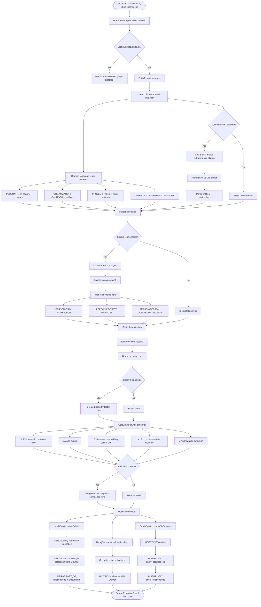
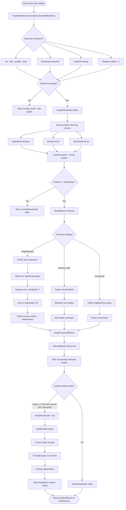

# Graph RAG Neo4j Flow

## Overview
Complete knowledge graph pipeline for Cor7ex, covering entity extraction from documents via pattern-based and LLM-based methods, entity resolution with multi-strategy deduplication, dual storage in Neo4j and PostgreSQL, and graph-enhanced RAG refinement via neighborhood traversal for multi-hop queries.

## Trigger Points
- Document is uploaded and processed via the V2 pipeline (triggers entity extraction)
- RAG query contains multiple entities or multi-hop indicators (triggers graph refinement)
- Admin requests graph statistics via monitoring dashboard
- Document is deleted (triggers entity cleanup in Neo4j and PostgreSQL)

## Flow Diagram

### Entity Extraction and Storage (Document Ingestion)


### Graph-Enhanced RAG Refinement (Query Time)


## Key Components

### Graph Orchestration
- **File**: `server/src/services/graph/GraphService.ts` - Unified interface for all graph operations: extraction, resolution, storage, refinement, and cleanup
- **Function**: `GraphService.processDocument()` in `GraphService.ts` - Extracts entities from document chunks, resolves duplicates, stores in Neo4j + PostgreSQL
- **Function**: `GraphService.refineRAGResults()` in `GraphService.ts` - Post-query graph traversal to enrich RAG results
- **Function**: `GraphService.buildGraphContext()` in `GraphService.ts` - Converts traversal result to German-language markdown context
- **Function**: `createGraphServiceFromEnv()` in `GraphService.ts` - Factory function using environment variables (GRAPH_ENABLED, NEO4J_URI, etc.)

### Entity Extraction
- **File**: `server/src/services/graph/EntityExtractor.ts` - Pattern-based and LLM-based entity extraction from document chunks
- **Function**: `EntityExtractor.extract()` in `EntityExtractor.ts` - Main extraction pipeline: patterns + optional LLM + co-occurrence relationships
- **Function**: `EntityExtractor.extractWithPatterns()` in `EntityExtractor.ts` - German language regex patterns for 8 entity types (PERSON, ORGANIZATION, PROJECT, PRODUCT, LOCATION, DATE, REGULATION, TOPIC)
- **Function**: `EntityExtractor.extractWithLLM()` in `EntityExtractor.ts` - Ollama LLM extraction with JSON output format
- **Function**: `EntityExtractor.extractCooccurrenceRelationships()` in `EntityExtractor.ts` - Infers relationships from entities co-occurring in the same chunk

### Entity Resolution
- **File**: `server/src/services/graph/EntityResolver.ts` - Multi-strategy entity deduplication and merging
- **Function**: `EntityResolver.resolve()` in `EntityResolver.ts` - Groups by type, blocks for efficiency, calculates pairwise similarity, merges groups
- **Function**: `EntityResolver.calculateSimilarity()` in `EntityResolver.ts` - 5-strategy similarity: exact match, alias match, semantic (embedding cosine), fuzzy (Levenshtein), abbreviation detection
- **Function**: `EntityResolver.mergeEntities()` in `EntityResolver.ts` - Merges entity group: highest confidence canonical form, combined aliases and occurrences

### Graph Refinement (RAG Enhancement)
- **File**: `server/src/services/graph/GraphRefinement.ts` - Post-query graph traversal to enrich RAG results with related entities
- **Function**: `GraphRefinement.refine()` in `GraphRefinement.ts` - Extracts entities from top chunks, traverses graph, finds additional chunk IDs
- **Function**: `GraphRefinement.shouldUseGraphRefinement()` in `GraphRefinement.ts` - Detects multi-hop queries via German language patterns
- **Function**: `GraphRefinement.buildGraphContext()` in `GraphRefinement.ts` - Formats graph traversal result as German markdown with translated entity types and relationship names

### Neo4j Database Service
- **File**: `server/src/services/graph/Neo4jService.ts` - Neo4j driver wrapper with Cypher query execution
- **Function**: `Neo4jService.storeEntities()` in `Neo4jService.ts` - Batch stores entities with UNWIND, adds type labels via APOC, creates MENTIONED_IN and PART_OF relationships
- **Function**: `Neo4jService.storeRelationships()` in `Neo4jService.ts` - Batch stores relationships grouped by type
- **Function**: `Neo4jService.traverse()` in `Neo4jService.ts` - Graph traversal with 3 strategies: neighborhood (APOC path expansion), shortest_path, community
- **Function**: `Neo4jService.findEntitiesByText()` in `Neo4jService.ts` - Entity lookup by canonical form, text, or aliases
- **Function**: `Neo4jService.deleteDocumentEntities()` in `Neo4jService.ts` - Cascading delete: chunks, then orphaned entities

### Types
- **File**: `server/src/types/graph.ts` - TypeScript types for all graph operations: Entity, Relationship, GraphNode, GraphEdge, TraversalStrategy, configs

### Database Tables (PostgreSQL)
- **Database**: `entities` - Extracted entities with type, text, canonical_form, aliases, confidence, neo4j_synced flag
- **Database**: `entity_occurrences` - Links entities to documents and chunks with position and context
- **Database**: `entity_relationships` - Relationships between entities with type, confidence, evidence, extraction_method
- **Database**: `entity_merge_history` - Audit trail for entity resolution merges

### Migrations
- **File**: `server/src/migrations/007_graph_entities.sql` - Creates entities, entity_occurrences, entity_relationships, entity_merge_history tables; graph_statistics view

## Data Flow

1. **Input (Ingestion)**: Document chunks from ChunkingPipeline
   ```typescript
   {
     documentId: string,
     chunks: Array<{ id?: string; content: string }>
   }
   ```

2. **Extraction Transformations**:
   - Pattern-based extraction scans each chunk with German regex patterns for 8 entity types
   - Optional LLM extraction sends chunk text to Ollama (qwen2.5:14b) with JSON output format
   - Co-occurrence analysis infers relationships from entities appearing in the same chunk
   - Basic deduplication groups entities by type + canonical form

3. **Resolution Transformations**:
   - Group entities by type (cross-type merging prevented)
   - Optional blocking by first 3 characters of canonical form (reduces O(n^2) comparisons)
   - 5-strategy pairwise similarity calculation (exact, alias, semantic, fuzzy, abbreviation)
   - Merge groups with similarity >= 0.85: highest confidence canonical form, combined aliases and occurrences

4. **Storage Output**: Entities and relationships stored in both Neo4j and PostgreSQL
   ```typescript
   {
     entities: Entity[],         // Resolved entities
     relationships: Relationship[], // Extracted relationships
     stats: {
       entitiesExtracted: number,
       relationshipsExtracted: number,
       processingTimeMs: number,
       methodUsed: 'pattern' | 'llm' | 'hybrid'
     }
   }
   ```

5. **Input (Query Time)**: RAG refinement request
   ```typescript
   {
     query: string,
     queryEntities: string[],     // Entities extracted by QueryRouter
     topChunks: Array<{ id: string; content: string; score: number }>,
     maxDepth: 2,                 // Graph traversal depth
     maxNodes: 50                 // Max nodes to return
   }
   ```

6. **Refinement Output**: Graph-enhanced context for LLM generation
   ```typescript
   {
     additionalChunkIds: string[],  // New chunks discovered via graph
     graphContext: {
       nodes: GraphNode[],
       edges: GraphEdge[],
       chunkIds: string[],
       naturalLanguageSummary: string  // German-language graph summary
     },
     shouldUseGraph: boolean
   }
   ```

## Neo4j Graph Schema

### Node Types
| Label | Properties | Description |
|-------|-----------|-------------|
| Entity | id, type, text, canonicalForm, aliases, confidence, updatedAt | Base entity node (also has type-specific label) |
| PERSON | (inherits Entity) | Person entities |
| ORGANIZATION | (inherits Entity) | Organization entities |
| PROJECT | (inherits Entity) | Project entities |
| PRODUCT | (inherits Entity) | Product entities |
| DOCUMENT | id | Document reference node |
| Chunk | id | Chunk reference node |
| LOCATION | (inherits Entity) | Location entities |
| DATE | (inherits Entity) | Date entities |
| REGULATION | (inherits Entity) | Regulation entities |
| TOPIC | (inherits Entity) | Topic entities |

### Relationship Types
| Type | Source | Target | Description |
|------|--------|--------|-------------|
| MENTIONED_IN | Entity | Chunk | Entity appears in this chunk (position property) |
| PART_OF | Chunk | Document | Chunk belongs to document |
| WORKS_FOR | PERSON | ORGANIZATION | Employment relationship |
| MANAGES | PERSON | PROJECT | Person manages project |
| CREATED | ORGANIZATION | PROJECT/PRODUCT | Organization created something |
| COLLABORATES_WITH | PERSON | PERSON | Collaboration between people |
| REFERENCES | DOCUMENT | REGULATION | Document references regulation |
| ABOUT | DOCUMENT | TOPIC | Document is about topic |
| REPORTS_TO | PERSON | PERSON | Reporting hierarchy |
| APPROVED_BY | any | PERSON | Approval relationship |
| MENTIONS | any | any | Generic mention |

### Neo4j Indexes
- `entity_id` on `Entity.id`
- `entity_canonical` on `Entity.canonicalForm`
- `entity_type` on `Entity.type`
- `document_id` on `Document.id`
- `chunk_id` on `Chunk.id`

## Error Scenarios
- Neo4j connection failure during initialization (GraphService disables itself, app continues without graph)
- Neo4j unavailable at query time (refineRAGResults returns empty result with shouldUseGraph: false)
- LLM extraction fails (Ollama unavailable or JSON parse error - falls back to pattern-only extraction)
- Entity resolution embedding generation fails (falls back to fuzzy-only matching)
- PostgreSQL persistence fails during entity storage (logged as error, Neo4j storage may still succeed)
- Document deletion fails to clean Neo4j entities (orphaned entities remain until next cleanup)
- APOC procedures not available in Neo4j (traversal queries fail - requires APOC plugin)
- Entity extraction produces too many entities (maxEntitiesPerChunk: 50 per chunk limit)

## Dependencies
- **Neo4j** `:7687` - 5.26-community with APOC plugin for graph traversal (neighborhood expansion, path algorithms)
- **PostgreSQL** `:5432` - Persistent storage for entities, occurrences, relationships, merge history (synced with Neo4j)
- **Ollama** `:11434` - Optional LLM extraction (qwen2.5:14b) and embedding generation (nomic-embed-text, 768d) for semantic entity resolution
- **neo4j-driver** `6.x` - Node.js driver for Neo4j with session/database management
- **uuid** - Entity and relationship ID generation

---

Last Updated: 2026-02-06
