# RAG Pipeline Flow

## Overview
Complete Retrieval-Augmented Generation pipeline for the Vexora project, covering the full query lifecycle from user input through guardrails, query routing, hybrid search, reranking, document expansion, optional graph enrichment, LLM generation, and output validation with end-to-end tracing.

## Trigger Points
- User sends a chat message with RAG enabled (manual, automatic, or always mode)
- Frontend `RAGContext` determines RAG activation based on intent detection
- POST `/api/chat` with `rag.enabled: true` in request body

## Flow Diagram

```mermaid
graph TD
    A([User Query]) --> B["POST /api/chat"]
    B --> C{RAG Enabled?}
    C -->|No| D[Standard Ollama Chat]
    C -->|Yes| E[Start Trace]

    E --> F[Input Guardrails]
    F --> F1{Input Valid?}
    F1 -->|No| F2[Return Error Message]
    F1 -->|Yes| G[Query Sanitization]

    G --> GR{Follow-up with<br/>references?}
    GR -->|Yes| GR1["QueryRewriter.rewrite<br/>(think:false, truncated history)"]
    GR1 --> H[QueryRouter.analyze]
    GR -->|No| H
    H --> H1[Classify Query Type]
    H1 --> H2[Extract Entities]
    H2 --> H3[Detect Multi-Hop]
    H3 --> H4[Select Retrieval Strategy]
    H4 --> H5[Determine Level Filter]

    H5 --> H6{Manual levelFilter<br/>provided?}
    H6 -->|Yes| H7["Use manual override"]
    H6 -->|No| H8["Use QueryRouter recommendation"]
    H7 --> I{User Has Context?}
    H8 --> I
    I -->|Yes| J[Set PostgreSQL RLS Context]
    J --> K[Get Accessible Document IDs]
    K --> K1{Documents Found?}
    K1 -->|No| K2[Return No-Permission Message]
    I -->|No| L[Search All Documents]

    K1 -->|Yes| M{V2 Search?}
    L --> M
    M -->|Yes| N["VectorServiceV2 Hybrid Search"]
    M -->|No| O["VectorService Hybrid Search"]

    N --> P[Weaviate Hybrid Query]
    O --> P
    P --> P1["BM25 Keyword + Vector Semantic"]
    P1 --> P2["RelativeScoreFusion (alpha=0.3)"]

    P2 --> Q{Results Found?}
    Q -->|No| Q1[Return No-Sources Message]
    Q -->|Yes| R{Reranker Available?}

    R -->|Yes| S["RerankerService (BGE-reranker-v2-m3)"]
    S --> S1["Reorder: reranker score = primary score"]
    S1 --> S1A["Preserve hybrid score as hybridScore"]
    S1A --> S2["Top-K Selection (default: 5)"]
    R -->|No| S2

    S2 --> T{Document Expansion<br/>enabled and V2?}
    T -->|Yes| U["getChunksByDocumentIds<br/>(top 3 docs, threshold >= 0.3)"]
    U --> U1["Merge: search results + expansion chunks"]
    T -->|No| V[Continue]
    U1 --> V

    V --> W{Graph Enabled?}
    W -->|Yes| X[Extract Query Entities]
    X --> Y["GraphService.refineRAGResults"]
    Y --> Z["Neo4j Traversal (max depth: 2)"]
    Z --> Z1[Build Graph Context]
    W -->|No| AA[Build Context]
    Z1 --> AA

    AA --> BB[Build System Prompt]
    BB --> CC["Ollama LLM Generation"]
    CC --> DD[Output Guardrails]
    DD --> DD1[Citation Check]
    DD1 --> DD2[Groundedness Check]
    DD2 --> EE[Extract Sources]
    EE --> FF[End Trace]
    FF --> GG([Return Response + Sources])
```


## Key Components

### Query Rewriting (Conversational Context)
- **File**: `server/src/services/rag/QueryRewriter.ts` - Resolves pronouns and references in follow-up questions using chat history so the vector search receives a self-contained query
- **Function**: `QueryRewriter.needsRewriting()` - Pattern-based detection of unresolved references (German/English demonstratives and pronominal adverbs like "dieses", "dazu", "darüber", "dem Dokument", "this", "that"). Skips first user message. Saves ~60-70% of LLM calls
- **Function**: `QueryRewriter.rewrite()` - Calls `ollamaService.chat()` with `think: false` (disables Qwen3 thinking mode), `temperature: 0.7` (Qwen3 forbids greedy decoding), truncated assistant messages (max 500 chars each), last 6 messages. Falls back to original query on error or empty response
- **Design Decisions**: Uses same chat model, no separate rewrite model. `think: false` prevents Qwen3 from consuming all output tokens on thinking. Assistant messages truncated because only topic context is needed for reference resolution (pattern from LangChain CondenseQuestionChain / LlamaIndex CondensePlusContext)

### Query Intelligence (Phase 5)
- **File**: `server/src/services/rag/QueryRouter.ts` - Classifies queries (factual, comparative, procedural, relational, aggregative, temporal) and selects optimal retrieval strategy
- **Function**: `QueryRouter.analyze()` in `QueryRouter.ts` - Analyzes query type, extracts entities, determines level filter and retrieval strategy
- **Function**: `QueryRouter.getLevelFilterForQueryType()` in `QueryRouter.ts` - Returns recommended chunk level filter based on query type (can be overridden via manual `levelFilter` parameter in RAGRequest)

### Input/Output Safety (Phase 5)
- **File**: `server/src/services/guardrails/Guardrails.ts` - Input validation (injection detection, rate limiting, sanitization) and output validation (citation check, groundedness scoring)
- **Function**: `InputGuardrails.validate()` - Blocks prompt injection patterns, enforces query length limits
- **Function**: `OutputGuardrails.validate()` - Ensures response cites sources and remains grounded in context

### Core RAG Orchestration
- **File**: `server/src/services/RAGService.ts` - Central orchestrator for the entire RAG pipeline (both streaming and non-streaming)
- **Function**: `RAGService.generateResponse()` - Non-streaming RAG pipeline
- **Function**: `RAGService.generateStreamingResponse()` - Streaming RAG pipeline with SSE

### Vector Search
- **File**: `server/src/services/VectorServiceV2.ts` - Weaviate V2 hybrid search with hierarchical chunk schema (level 0=doc, 1=section, 2=paragraph)
- **File**: `server/src/services/VectorService.ts` - Legacy V1 Weaviate search (flat chunks)
- **Function**: `VectorServiceV2.search()` - Hybrid search combining BM25 keyword + vector semantic with configurable alpha
- **Function**: `VectorServiceV2.getChunksByDocumentIds()` - Loads all chunks for specific documents (used by Document Expansion to provide full document context)
- **Database**: Weaviate `DocumentChunksV2` collection - Hierarchical chunks with embeddings

### Embedding Generation
- **File**: `server/src/services/EmbeddingService.ts` - Generates text embeddings via Ollama API
- **Function**: `EmbeddingService.generateEmbedding()` - Single text embedding using `nomic-embed-text` (768 dimensions)

### Reranking (Phase 1)
- **File**: `server/src/services/rag/RerankerService.ts` - Client for Python reranker microservice using BGE-reranker-v2-m3
- **Function**: `RerankerService.rerank()` - Reranks chunks by cross-encoder relevance, returns top-K with reranker scores. Reranker score replaces hybrid score as primary `score` field; original hybrid score preserved as `hybridScore` for debugging

### Graph Enrichment (Phase 4)
- **File**: `server/src/services/graph/GraphService.ts` - Orchestrates entity extraction, resolution, and graph traversal for multi-hop queries
- **File**: `server/src/services/graph/Neo4jService.ts` - Neo4j graph database client
- **File**: `server/src/services/graph/EntityExtractor.ts` - Extracts entities (persons, organizations, projects) from text
- **File**: `server/src/services/graph/EntityResolver.ts` - Resolves duplicate entities via embedding similarity

### Observability (Phase 5)
- **File**: `server/src/services/observability/TracingService.ts` - End-to-end tracing with spans for each pipeline step (query_analysis, vector_search, reranking, graph_traversal, llm_generation, guardrails)
- **Database**: PostgreSQL `rag_traces` table - Persisted trace data for monitoring
- **Note**: Both streaming (`generateStreamingResponse`) and non-streaming (`generateResponse`) paths create traces with full span instrumentation. Streaming traces capture total latency and end on stream completion or error.

### Document Processing
- **File**: `server/src/services/DocumentService.ts` - Multi-format document ingestion (PDF, DOCX, PPTX, XLSX, HTML, MD, TXT)
- **File**: `server/src/services/parsing/ParserClientService.ts` - Client for Python Docling-based parser microservice
- **File**: `server/src/services/chunking/ChunkingPipeline.ts` - Orchestrates SemanticChunker, TableChunker, and HierarchicalIndexer

### Frontend
- **File**: `src/contexts/RAGContext.tsx` - React context managing RAG mode (manual/automatic/always) and intent detection
- **File**: `src/lib/intentDetection.ts` - Client-side query intent analysis for automatic RAG activation
- **File**: `src/contexts/ChatContext.tsx` - Chat state management, sends RAG requests to backend

### API & Server
- **File**: `server/src/index.ts` - Express server with `/api/chat` endpoint handling RAG-enabled streaming
- **File**: `server/src/services/DatabaseService.ts` - PostgreSQL connection with RLS (Row-Level Security) for permission-aware queries

## Data Flow
1. Input: Chat request with RAG parameters
   ```typescript
   {
     messages: ChatMessage[],
     model: string,          // e.g., "qwen3:8b"
     stream: boolean,
     rag: {
       enabled: true,
       query: string,
       searchLimit: number,     // default: 5 (API) -> 20 (internal for reranking)
       searchThreshold: number, // default: 0.1
       hybridAlpha: number,     // default: 0.3 (70% BM25, 30% vector)
     },
     // Optional manual override (RAGRequest):
     levelFilter?: ChunkLevel[],           // Manual chunk level override [0,1,2]
     enableDocumentExpansion?: boolean,     // default: true
     maxDocumentsToExpand?: number,         // default: 3
     maxChunksPerDocument?: number,         // default: 20
     expansionThreshold?: number,           // default: 0.3
   }
   ```
2. Transformations:
   - Input guardrails sanitize query and check for injection patterns
   - QueryRewriter resolves pronouns/references in follow-up questions using chat history (e.g., "dieses Dokument" → "AMA.pdf"). Uses `think: false` and truncated history to avoid empty Qwen3 responses
   - QueryRouter classifies query type and selects retrieval strategy + level filter
   - Manual `levelFilter` override takes precedence over QueryRouter recommendation
   - PostgreSQL RLS filters documents by user permissions (role, department)
   - Weaviate hybrid search returns scored chunks (BM25 + vector fusion, alpha=0.3)
   - Reranker (BGE-reranker-v2-m3) re-scores top candidates; reranker score becomes primary score, original hybrid score preserved as `hybridScore`
   - Document expansion loads all Level-2 chunks from top-scoring documents (threshold >= 0.3, max 3 docs, max 20 chunks/doc)
   - Graph enrichment (optional) traverses Neo4j for related entities
   - Context and system prompt built from search results + graph context
   - Ollama LLM generates response with source citations
   - Output guardrails validate citation presence and groundedness
   - End-to-end tracing persists spans for both streaming and non-streaming paths
3. Output: RAG response with sources
   ```typescript
   {
     message: string,           // LLM-generated answer with citations
     sources: RAGSource[],      // Array of cited document chunks
     //   Each source includes:
     //   - score: number        // Reranker score (if reranked) or hybrid score
     //   - hybridScore?: number // Original hybrid fusion score (before reranking)
     searchResults: VectorSearchResponse,
     hasRelevantSources: boolean,
     graphEnriched?: boolean,
     graphContext?: string,
   }
   ```

## Error Scenarios
- Input guardrails reject query (injection detection, too long, rate limited)
- Query rewriting returns empty/unusable result (graceful fallback to original query)
- User has no accessible documents (RLS returns empty set)
- Weaviate connection failure or search error
- No relevant chunks found above threshold (0.1)
- Reranker microservice unavailable (graceful fallback to original ordering)
- Document expansion failure (graceful fallback - continues without expansion chunks)
- Graph service (Neo4j) unavailable (continues without graph enrichment)
- Ollama LLM connection failure or timeout
- Output guardrails detect low groundedness (response still returned with warnings)
- Stream interrupted by client disconnect (cleanup of user context ensured, trace ended)

## Dependencies
- **Weaviate** `:8080/:50051` - Vector database for hybrid search (BM25 + semantic), stores DocumentChunksV2 collection
- **PostgreSQL** `:5432` - Document metadata, user permissions (RLS), trace persistence, audit logs
- **Redis** `:6379` - Caching, session management, background job processing
- **Ollama** `:11434` - LLM inference (chat completions) and embedding generation (nomic-embed-text, 768d)
- **Reranker Microservice** `:8001` - Python service running BGE-reranker-v2-m3 for cross-encoder reranking
- **Parser Microservice** `:8002` - Python Docling-based service for multi-format document parsing
- **Neo4j** (optional) - Knowledge graph for entity relationships and multi-hop queries

---

Last Updated: 2026-02-11
